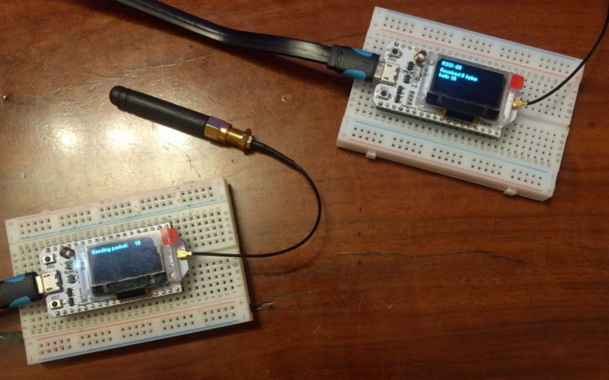
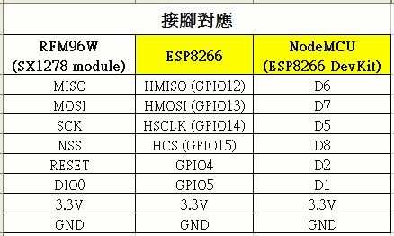

# micropython_LoRa_P2P
after a few false starts this is an attempt to get LoRa communications workign for microcontrollers using Micropython

# hardware

- ESP8266 [Wemos D1 Mini dev board](https://www.aliexpress.com/store/product/D1-mini-Mini-NodeMcu-4M-bytes-Lua-WIFI-Internet-of-Things-development-board-based-ESP8266/1331105_32529101036.html?spm=a2g1y.12024536.productList_2559240.subject_2) with [a shield](https://pcbs.io/share/4Q1Z4) based on [design by Hallard](https://pcbs.io/share/4Q1Z4) fitted with [RFM95W](https://www.aliexpress.com/item/RFM95W-RFM95-868MHz-LORA-SX1276-wireless-transceiver-module-20DBM-3KM-Best-quality/32810607598.html?spm=a2g0s.9042311.0.0.27424c4duzhc4x) 
- ESP32 [Heltec dev board](https://www.aliexpress.com/item/2pcs-868MHz-915MHz-SX1276-ESP32-LoRa-OLED-0-96-Inch-Blue-Display-Bluetooth-WIFI-ESP32-ESP/32838347451.html?spm=a2g0s.9042311.0.0.27424c4dwkLvkQ) with built in LoRa transciever chip

#  software

- [Hallard firmware](https://github.com/hallard/WeMos-Lora/tree/master/firmware)
- 

on the Micropython front
- [Wei's original micropython driver](https://github.com/Wei1234c/SX127x_driver_for_MicroPython_on_ESP8266)
- [fork of Wei's work for the TTGO](https://github.com/rcludwick/Lora_driver_for_MicroPython_on_ttgo), a similar board to the Heltecp
- 

# support material

- [Dave's tech notes](https://www.youtube.com/watch?v=0xP1h1Qx4Ao) gives a step by step intro (Arduino)
- [Andreas video](https://www.youtube.com/watch?v=WV_VumvI-0A) is also a great overview tutorial (Arduino)
- [Fernando's excellent series on LoRa](https://www.instructables.com/id/ESP32-Lora-Changing-Frequency/) (also Arduino!)

# Stage 1
Make sure the transievers actually work!  
2018-11-24 Tested the Heltec dev boards with their [Arduino library](https://github.com/Heltec-Aaron-Lee/WiFi_Kit_series#instructions)
Sending and recieving at 915MHz was achieved. 

 

# Stage 2
attempt to map Wei's library

Wei used a Node MCU

  

we are using a Wemos D1 Mini  
  WeMos D1    <----> RFM9x Module  
  GPIO12 (D6) <----> MISO  
  GPIO13 (D7) <----> MOSI  
  GPIO14 (D5) <----> CLK  
  GPIO15 (D8) <----> DIO0/D2 OR DIO1/D3 OR DIO2/D4  
  GPIO02 (D4) <----> SEL (Chip Select)  
  RST         <----> RST  

verified
- config_lora.py
- controller_esp.py unclear reset Pin allocation
- sx127x.py only adjusted freq 
 
to do  
- 

